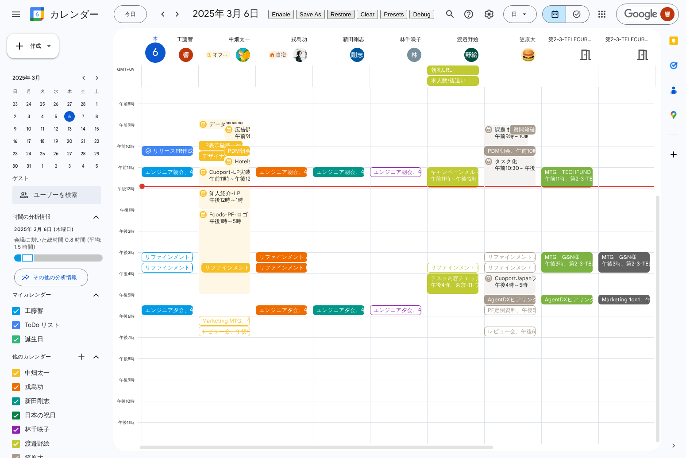
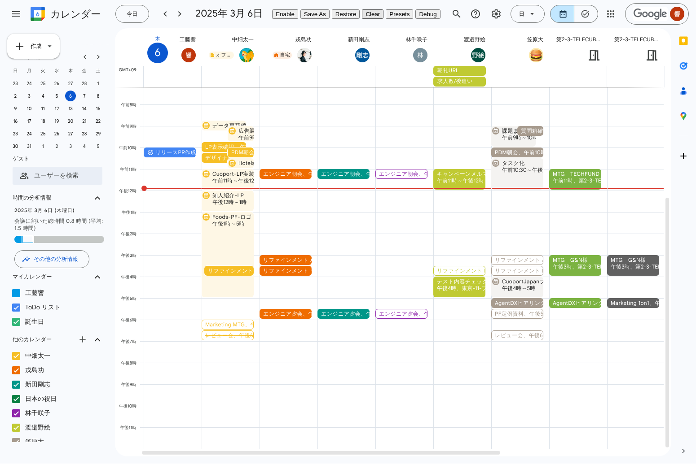
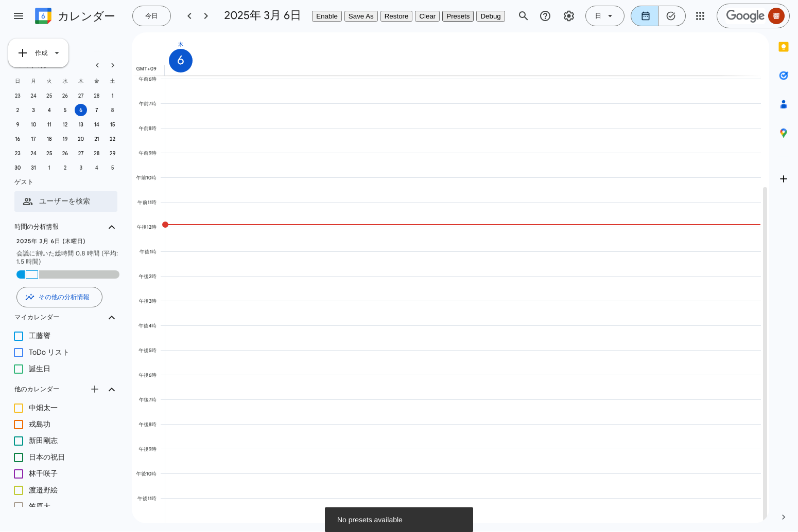
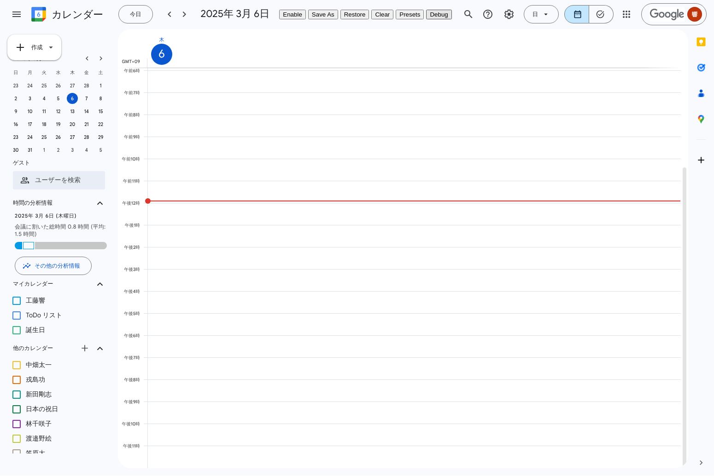

# Calendar Selector for Google Calendar

## 1. コードの内容

### a. Google Chromeの拡張機能
このリポジトリは、Google Chrome向けの拡張機能「Calendar Selector for Google Calendar」のソースコードを含んでいます。

### b. Google Calendar上で個人のカレンダーを自動選択して、プリセットとして保存管理ができるツール
この拡張機能は、Google Calendarで表示する複数のカレンダーの組み合わせをプリセットとして保存し、ワンクリックで復元することができます。これにより、特定のプロジェクトや目的に応じたカレンダーグループを簡単に切り替えることが可能になります。

## 2. Google Chromeの拡張機能の設定の仕方

### インストール方法
1. このリポジトリをクローンまたはダウンロードします
2. Google Chromeを開き、`chrome://extensions/`にアクセスします
3. 右上の「デベロッパーモード」をオンにします
4. 「パッケージ化されていない拡張機能を読み込む」をクリックします
5. ダウンロードしたリポジトリのフォルダを選択します

### a. コードの検証方法
拡張機能のコードを検証するには以下の手順を実行します：

1. 拡張機能をインストール後、Google Calendarにアクセスします（`https://calendar.google.com/`）
2. Chromeの開発者ツールを開きます（F12キーまたは右クリック→「検証」）
3. 「Console」タブを選択し、拡張機能のログメッセージを確認します
4. 「Elements」タブで拡張機能によって追加されたUIコンポーネントを確認できます
5. 「Application」タブの「Storage」→「Local Storage」で拡張機能が保存しているデータを確認できます

## 3. 拡張機能の機能説明

### 主な機能
- **カレンダーグループの保存**: 現在選択されているカレンダーの組み合わせをプリセットとして保存できます
- **カレンダーグループの復元**: 保存したプリセットをワンクリックで復元できます
- **プリセットの管理**: 保存したプリセットの名前変更や削除が可能です
- **ショートカットキー**: キーボードショートカットを使用して素早くプリセットを切り替えることができます

#### カレンダーグループの保存

#### カレンダーグループの復元

#### カレンダーグループのクリア

#### プリセット管理

#### デバッグ機能

### 技術的な詳細
- この拡張機能はGoogle Calendarのページに直接統合され、カレンダー選択UIを拡張します
- Vue.jsとVuetifyを使用してUIコンポーネントを構築しています
- カレンダーの状態はChrome Storageに保存され、ブラウザ間で同期されます
- コンテンツスクリプトを使用してGoogle Calendarページに機能を注入しています

### 対応ブラウザ
- Google Chrome
- Chromiumベースのブラウザ（Microsoft Edge、Brave、Operaなど）
